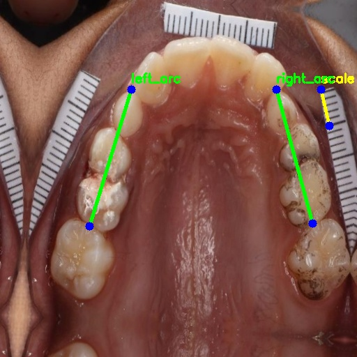

# Anatomy-Constrained Landmark Learning for Automated Pediatric Mixed Dentition Space Analysis

**Anonymized Authors**  
**Anonymized Affiliations**  
`email@anonymized.com`

## Abstract
Mixed dentition space analysis is essential for early orthodontic planning in pediatric patients. Conventional approaches such as Moyers and Tanaka–Johnston analyses depend on physical dental casts or intraoral scans, leading to time-intensive and costly workflows. We propose an automated framework for pediatric mixed dentition assessment using structure-aware deep landmark learning from routine dental images. The method formulates maxillary and mandibular arch evaluation as structured landmark regression with geometry-based constraints that enforce anatomical continuity, inter-tooth dimensional consistency, and adjacency preservation. These constraints reduce anatomically implausible predictions and improve robustness in data-limited settings. The predicted landmarks are used to compute mesiodistal tooth widths and estimate arch space discrepancy following standard orthodontic protocols. A clinical study was conducted in collaboration with orthodontists, and measurements were verified by expert clinicians. Results demonstrate improved structural stability and clinically reliable space discrepancy estimation compared to unconstrained baselines. This work supports low-cost, image-based pediatric orthodontic analysis and emphasizes the role of anatomy-aware learning for reliable craniofacial assessment.

## Project Overview
This repository contains an end-to-end heatmap-based landmark learning pipeline for pediatric maxillary and mandibular mixed dentition analysis:

- **Baseline heatmap model** (`heatmap/train.py`)
- **Anatomy-constrained variant** (`heatmap/train_arc.py`)
- **Post-processing and visualization** (`heatmap/infer.py`)
- **Experiment history/log** (`heatmap/EXPERIMENT_LOG.md`)

The current workflow predicts structured line landmarks and applies anatomy-aware correction rules to reduce left/right arc swaps, crossing arcs, and unrealistic scale geometry.

## Method Summary
### 1) Structured Landmark Formulation
Each image is represented as line endpoints (14 keypoints max):
- **Mandible:** `scale`, `incisor1`, `incisor2`, `incisor3`, `incisor4`, `left_arc`, `right_arc`
- **Maxilla:** `scale`, `left_arc`, `right_arc` (remaining points padded)

### 2) Heatmap Regression Backbone
- ResNet-50 encoder + transposed-convolution decoder
- Multi-channel keypoint heatmap output (`NUM_KPS=14`)
- Masked MSE-style heatmap objective for valid keypoints only

### 3) Anatomy-Constrained Learning / Inference
Implemented constraints include:
- left/right arc ordering by x-coordinate
- endpoint reassignment to avoid crossed arc pairings
- minimum arc separation
- arc verticality preference (`|dx|` bounded relative to `|dy|`)
- scale geometry constraint (`|dx| <= 15 px`)

## Repository Structure
```text
MICCAI_FINAL/
├── README.md
├── assets/
│   └── qualitative/
│       ├── baseline_mandible.jpg
│       ├── anatomy_mandible.jpg
│       ├── baseline_maxilla.jpg
│       └── anatomy_maxilla.jpg
└── heatmap/
    ├── train.py
    ├── train_arc.py
    ├── infer.py
    ├── EXPERIMENT_LOG.md
    ├── heatmap_results_1/
    ├── heatmap_results_arc/
    ├── hrnet_results/
    └── hrnet_results_arc/
```

## Qualitative Results
### Mandible Example
| Baseline | Anatomy-Constrained |
|---|---|
|  |  |

### Maxilla Example
| Baseline | Anatomy-Constrained |
|---|---|
|  |  |

## Environment
Tested with Python 3.9+ and PyTorch.

Install dependencies:
```bash
pip install torch torchvision opencv-python numpy scikit-learn tqdm
```

## Data Configuration
Current scripts expect:
- images: `/data1/sandeep_projects/dental_analysis/augmented_dataset/images`
- annotations: `/data1/sandeep_projects/dental_analysis/augmented_dataset/combined_annotations_augmented.json`


## Training
### Baseline
```bash
cd heatmap
python train.py
```
Outputs:
- `heatmap_results_1/heatmap_best.pth`
- `heatmap_results_1/test_predictions.json`

### Anatomy-Constrained
```bash
cd MICCAI_FINAL/heatmap
python train_arc.py
```
Outputs:
- `heatmap_results_arc/heatmap_best.pth`
- `heatmap_results_arc/test_predictions.json`

## Inference / Visualization
```bash
cd MICCAI_FINAL/heatmap
python infer.py
```
Outputs:
- `hrnet_results_arc/visualizations/`
- `hrnet_results_arc/test_predictions_corrected.json`

## Evaluation
Current training scripts report:
- line-wise mean pixel error
- overall mean line pixel error

For experiment-by-experiment details, see:
- `heatmap/EXPERIMENT_LOG.md`

## Reproducibility Notes
- Seeded split is used (`random_state=42`) for train/test split.
- Best checkpoint is selected by validation loss.
- If horizontal flip augmentation is introduced externally, ensure label remapping for side-specific landmarks (`left_arc <-> right_arc`) in flipped samples.

## Clinical Relevance
The framework targets low-cost, image-based pediatric orthodontic triage and planning support by generating structured measurements compatible with mixed dentition analysis workflows.

## Disclaimer
This code is for research use and not a standalone clinical decision system.
